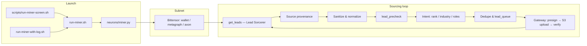
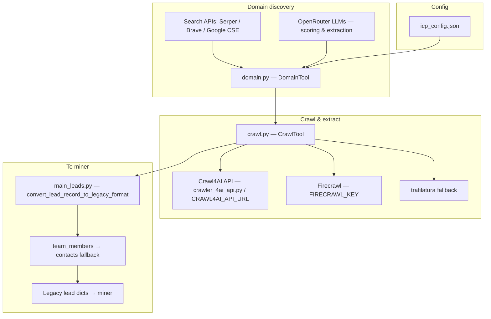
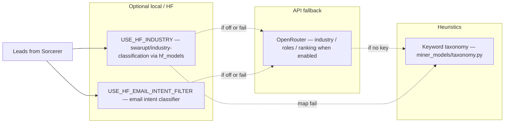
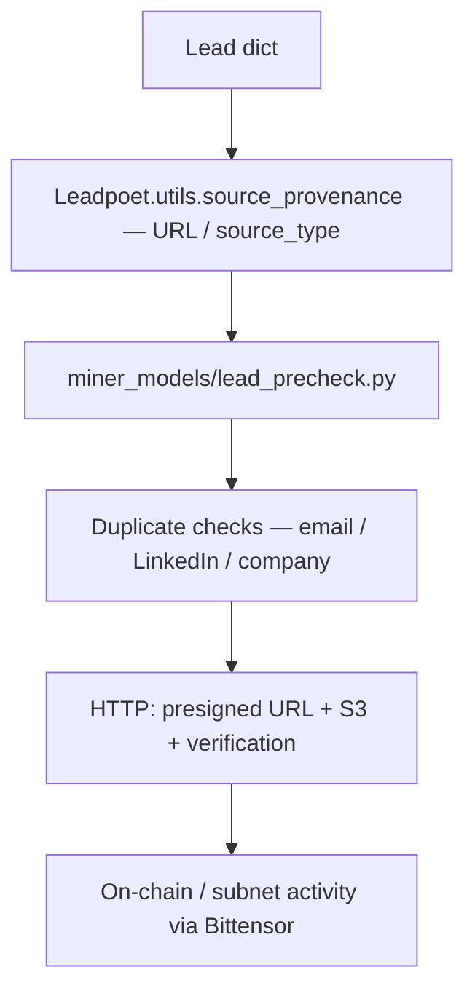

# Miner pipeline — visual workflow (models & tools)

Diagrams below render on GitHub/GitLab and in many Markdown previewers that support **Mermaid**.  
For the same flow with file/function references, see **[WORKFLOW-WITH-CODE.md](./WORKFLOW-WITH-CODE.md)**.

---

## 1. End-to-end flow



---

## 2. Lead Sorcerer (discovery → crawl → legacy shape)



---

## 3. Models & classifiers (after generation)



---

## 4. Validation & submission stack



---

## ASCII sketch (no Mermaid needed)

```
  screen / run-miner.sh
           │
           ▼
  neurons/miner.py ◄──────────────────────────────┐
           │                                        │
           │  get_leads()                            │
           ▼                                        │
  main_leads.py + orchestrator                      │
     │ domain (Serper/Brave/GSE + OpenRouter)       │
     │ crawl (Crawl4AI / Firecrawl / trafilatura)   │
     └► legacy leads (+ team_members→contacts)     │
           │                                        │
           ├► source_provenance                     │
           ├► sanitize                             │
           ├► lead_precheck                         │
           ├► intent_model (HF +/or OpenRouter)    │
           ├► lead_queue / dedupe                  │
           └► gateway upload ────────────────────────┘
```

---

## Environment flags (common)

| Flag / key | Role |
|------------|------|
| `SERPER_API_KEY` / `BRAVE_API_KEY` / `GSE_*` | Domain search |
| `OPENROUTER_KEY` | LLM calls in domain/crawl path & intent (unless disabled) |
| `FIRECRAWL_KEY` | Managed scrape/extract |
| `CRAWL4AI_API_URL`, `USE_CRAWL4AI_FIRST` | Local Crawl4AI service |
| `USE_HF_INDUSTRY`, `USE_HF_EMAIL_INTENT_FILTER` | HF classifiers in `miner_models/` |
| `USE_LEAD_PRECHECK` | Local gateway-aligned checks |
| `WALLET_NAME`, `WALLET_HOTKEY` | Bittensor wallet |

---

*Last updated: aligns with Lead Sorcerer + `neurons/miner.py` sourcing path in this repo.*
