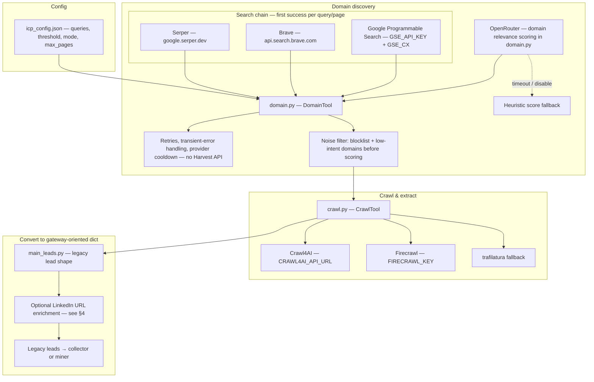
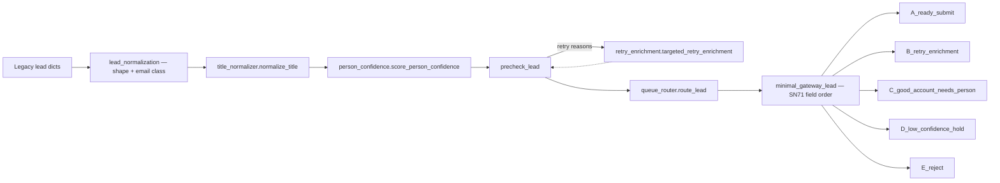
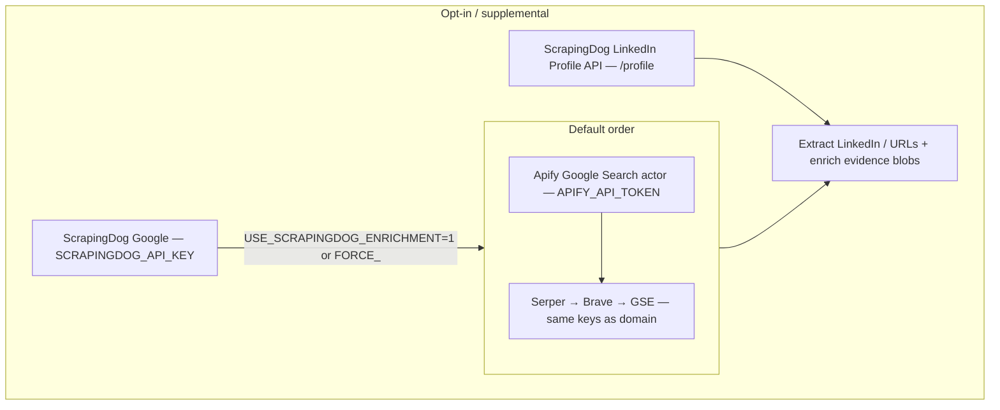
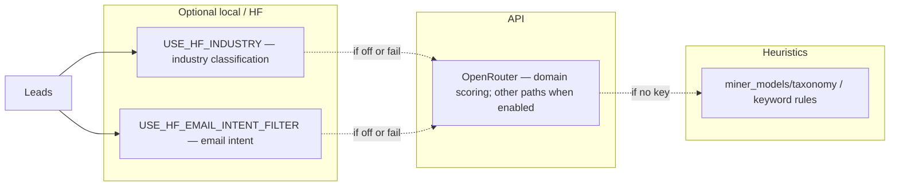
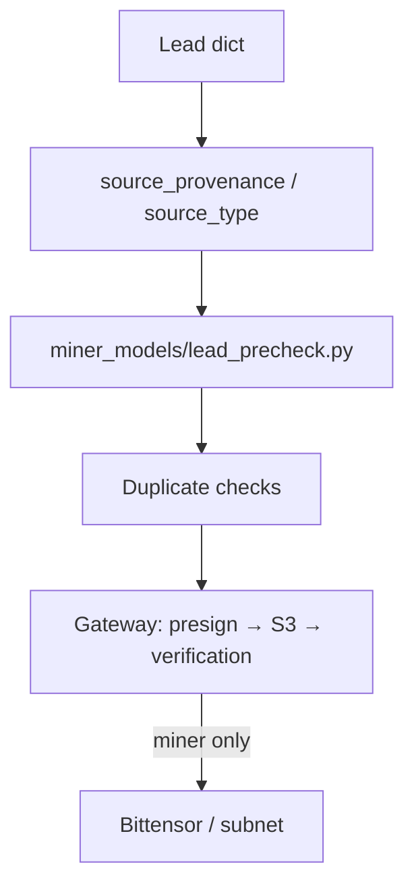

# Miner pipeline — visual workflow (models & tools)

Diagrams below render on GitHub/GitLab and in many Markdown previewers that support **Mermaid**.  
For the same flow with file/function references, see **[WORKFLOW-WITH-CODE.md](./WORKFLOW-WITH-CODE.md)**.

---

## Current active pipeline (collected-only)

```mermaid
flowchart TD
    A[Run command\nscripts/collect_leads_precheck_only.py] --> B[get_leads() in main_leads.py]
    B --> C[Lead Sorcerer orchestrator\nDomain discovery + scoring]
    C --> D[Crawl stage\nCrawl4AI / Firecrawl extraction]
    D --> E[Export artifacts\nreports/sorcerer_artifacts/...]
    E --> F[Load exported leads.jsonl]
    F --> G[Contact/anchor filter]
    G --> H[Convert to legacy lead format]
    H --> I[Finalize for SN71 precheck readiness]

    I --> J[Per-lead processing in collect_leads_precheck_only.py]
    J --> J1[normalize_legacy_lead_shape]
    J1 --> J2[normalize_title + person_confidence]
    J2 --> J3[apply_email_classification]
    J3 --> K[precheck_lead]

    K -->|pass| L[minimal_gateway_lead\nSN71-shaped payload]
    L --> M[Write\nlead_queue/collected_pass/<hash>.json]

    K -->|fail| N{retry reason allowed?}
    N -->|yes| O[targeted_retry_enrichment\n(non-ScrapingDog)]
    O --> P[re-normalize + re-precheck]
    P -->|pass| L
    P -->|fail| Q[Write fail payload]
    N -->|no| Q
    Q --> R[lead_queue/collected_precheck_fail/<hash>.precheck_failed.json]
```

- Active output stores are only `lead_queue/collected_pass` and `lead_queue/collected_precheck_fail`.
- A/B/C/D/E graded queue routing is no longer used by `collect_leads_precheck_only.py`.
- ScrapingDog profile repair is not used in the active collector path.

---

## 1. Two ways to run sourcing

```mermaid
flowchart TB
  subgraph onchain["Subnet miner (submit-capable)"]
    B[neurons/miner.py]
    B --> D[get_leads — Lead Sorcerer]
    D --> E[Provenance / sanitize]
    E --> G[lead_precheck]
    G --> I[lead_queue / dedupe]
    I --> J[Gateway: presign → S3 → verify]
    J -.->|loop| D
    S[scripts/run-miner-screen.sh] --> R[run-miner.sh]
    R --> B
  end

  subgraph local["Local collect + grade (no gateway)"]
    CLS[scripts/collect_leads_precheck_only.py]
    CLS --> D2[get_leads — same Sorcerer entry]
    D2 --> PREC[Precheck + title + person confidence]
    PREC --> ROUTE[scripts/queue_router.route_lead]
    ROUTE --> Q[lead_queue: A / B / C / D / E]
    Q --> PASS[collected_pass + precheck_fail JSON]
  end
```



- **`collect_leads_precheck_only.py`**: typical dev path — writes **`lead_queue/`** buckets and **`collected_pass`** / **`collected_precheck_fail`**, does **not** call the gateway.
- **`neurons/miner.py`**: full miner loop including gateway upload when configured.

---

## 2. Lead Sorcerer (discovery → crawl → legacy shape)



**Discovery env toggles:** `DOMAIN_DISCOVERY_USE_SERPER` (default on), `DOMAIN_DISCOVERY_USE_BRAVE`, `DOMAIN_DISCOVERY_USE_GSE`; at least one of Serper / Brave / GSE must be configured with keys.

---

## 3. After Sorcerer: grading, precheck, queues (local collect path)



---

## 4. Enrichment search stack (LinkedIn / SERP helpers)

Used from **`main_leads.py`** (async Apify + fallback) and **`scripts/convert_raw_to_pending.py`** (`search_urls`, `enrich_linkedin_fields`, ScrapingDog validate/fix).



`enrich_linkedin_fields` now updates not only LinkedIn URLs, but also person/company fields from evidence where values are missing or low-quality: `full_name`, `first`, `last`, `email`, `role`, `city/state/country` + HQ mirrors, `business`, `website`, `employee_count`, and `description`.

**B-queue maintenance:** `scripts/regrade_b_queue.py` can run **`validate_and_fix_with_scrapingdog`** (ScrapingDog-forced LinkedIn + field cleanup) and LinkedIn-location snippets, then re-precheck and optionally promote to **`A_ready_submit`**.

---

## 5. Models & classifiers (optional / parallel)



---

## 6. Validation & submission stack



For validator-aligned field rules, see **[AVOID-REJECTIONS.md](./AVOID-REJECTIONS.md)**.

---

## 7. Operator runbook path (precheck-first)

```mermaid
flowchart LR
  C[scripts/collect_leads_precheck_only.py] --> QA[lead_queue buckets A/B/C/D/E]
  QA --> R[scripts/check_submit_readiness.py]
  R -->|fix + promote| BQ[scripts/regrade_b_queue.py]
  BQ --> A[A_ready_submit]
  A --> M[scripts/a_ready_to_pending_minimal.py]
  M --> P[pending]
  P --> S[scripts/submit_queued_leads.py]
  S --> OK[submitted / failed outcomes]
```



- Typical local loop: `collect_leads_precheck_only.py` → `check_submit_readiness.py` → optional `regrade_b_queue.py`.
- Submit path: move strict A bucket to `pending` via `a_ready_to_pending_minimal.py`, then call `submit_queued_leads.py`.
- `collect_leads_precheck_only.py` supports both stop conditions: `--target-pass` and strict `--target-a-ready`.

---

## ASCII sketch (no Mermaid)

```
  scripts/collect_leads_precheck_only.py  (or neurons/miner.py)
           │
           ▼
  main_leads.get_leads + orchestrator
     │ domain: Serper → Brave → GSE + OpenRouter scoring (+ heuristic fallback)
     │ noise / blocklist pre-filter; provider retry + cooldown
     │ crawl: Crawl4AI / Firecrawl / trafilatura
     │ optional: Apify (+ opt-in ScrapingDog) for LinkedIn discovery in enrichment
     │ save run artifacts: reports/sorcerer_artifacts/<UTC>/{domain_pass,export_*}
     └► legacy lead dicts
           │
           ├► normalize_title · score_person_confidence · precheck_lead
           ├► targeted_retry_enrichment (selected failure reasons)
          ├► route_lead → A / B / C / D / E under lead_queue/
           ├► minimal_gateway_lead → collected_pass / precheck_fail
          ├► check_submit_readiness.py (validator-like audit)
          ├► regrade_b_queue.py (optional fix + promote to A)
           │
  miner path only:
           └► gateway upload ──► loop
```

---

## Environment flags (common)

| Flag / key | Role |
|------------|------|
| `SERPER_API_KEY`, `BRAVE_API_KEY`, `GSE_API_KEY`, `GSE_CX` | Domain discovery (chain order: Serper → Brave → GSE; only entries with keys+toggles) |
| `DOMAIN_DISCOVERY_USE_SERPER`, `_USE_BRAVE`, `_USE_GSE` | Enable/disable each discovery backend |
| `DOMAIN_PROVIDER_RETRY_ATTEMPTS`, `DOMAIN_PROVIDER_COOLDOWN_*` | Resilience for flaky search APIs |
| `OPENROUTER_KEY`, `OPENROUTER_*_MODEL`, `OPENROUTER_DISABLE` | Domain LLM scoring in `domain.py` |
| `APIFY_API_TOKEN`, `APIFY_SEARCH_ACTOR_ID` | Primary enrichment Google search in `main_leads` / `convert_raw_to_pending` |
| `SCRAPINGDOG_API_KEY`, `USE_SCRAPINGDOG_ENRICHMENT`, `FORCE_SCRAPINGDOG_ENRICHMENT` | ScrapingDog Google + LinkedIn profile enrichment helpers |
| `LEAD_SORCERER_RELAX_CONTACT_FILTER` | When `1`, keeps company-anchor records without contacts so downstream enrichment can still run |
| `FIRECRAWL_KEY` | Managed scrape/extract |
| `CRAWL4AI_API_URL`, `USE_CRAWL4AI_FIRST` | Local Crawl4AI service |
| `USE_HF_INDUSTRY`, `USE_HF_EMAIL_INTENT_FILTER` | HF classifiers in `miner_models/` |
| `USE_LEAD_PRECHECK` | Local gateway-aligned checks |
| `WALLET_NAME`, `WALLET_HOTKEY` | Bittensor wallet (miner) |

**Removed from pipeline:** Harvest API (`HARVEST_API_KEY`, `api.harvest-api.com`) — no longer used for domain discovery or LinkedIn search fallbacks.

---

*Last updated: March 2026 — includes precheck-first operator flow (`collect` → `readiness` → optional `regrade` → `submit`), broader LinkedIn-driven enrichment (`convert_raw_to_pending.py`), and persisted run artifacts under `reports/sorcerer_artifacts/`.*
